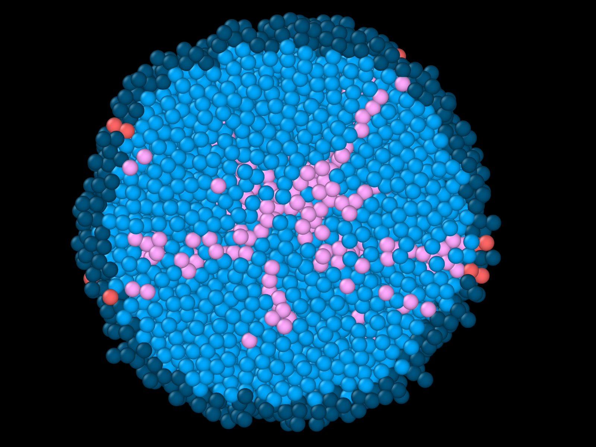
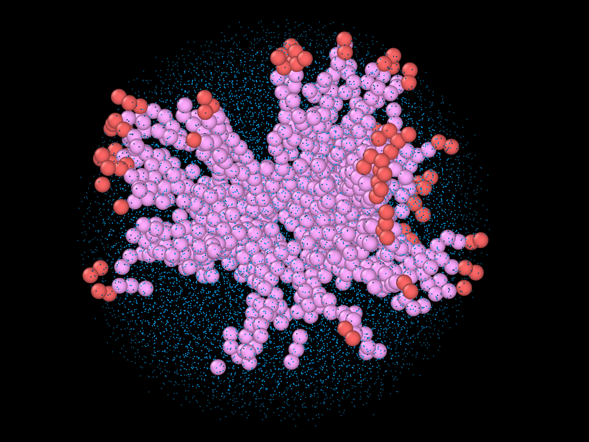

# `tumorsphere_culture`
Software for simulating tumorsphere cultures.

  
  

Description of directories:
- `tumorsphere` contains the source code of the package;
- `tests` contains the tests for pytest to find;
- `library` contains scripts for processing the output files produced by simulations;
- `examples` contains the bash scripts used to lunch simulations in the cluster;
- `data` contains one directory for each set of simulations sent to the cluster, including the corresponding scripts, output data, and post-processing.

Note: the package requires Python 3.10 or newer versions, since before 3.10, the `slots` option for `dataclass` was not available.

<video width="100%" controls>
  <source src="ovito_plotting/snapshots/ps_0.7/ps_0.7_24_tsteps.mp4" type="video/mp4">
  Your browser does not support the video tag.
</video>
